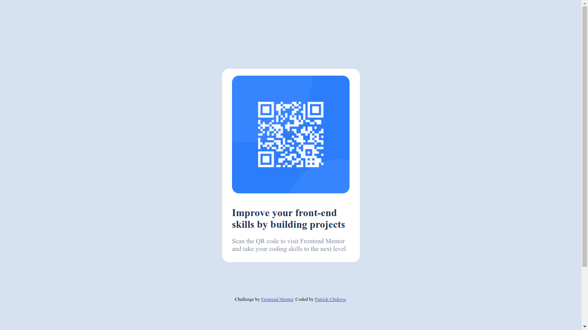

# Frontend Mentor - QR code component solution

This is a solution to the [QR code component challenge on Frontend Mentor](https://www.frontendmentor.io/challenges/qr-code-component-iux_sIO_H). Frontend Mentor challenges help you improve your coding skills by building realistic projects. 

## Table of contents

- [Overview](#overview)
  - [Screenshot](#screenshot)
  - [Links](#links)
- [My process](#my-process)
  - [Built with](#built-with)
- [Author](#author)

## Overview
For my first frontend project, I built a webpage with an embedded QR code.

### Screenshot

### Links

- Solution URL: [Add solution URL here](https://your-solution-url.com)
- Live Site URL: [Add live site URL here](https://your-live-site-url.com)

## My process
   - I built the markup first
   - Style with Mobile-first workflow
   - Then worked on tablet and desktop.
   
### Built with

- Semantic HTML5 markup
- CSS custom properties
- Flexbox
- Mobile-first workflow

## Author

- Website - [Patrick Chukwu](https://www.your-site.com)
- Frontend Mentor - [@patrickchukwu](https://www.frontendmentor.io/profile/patrickchukwu)
- Twitter - [@pattyfean](https://www.twitter.com/pattyfean)

