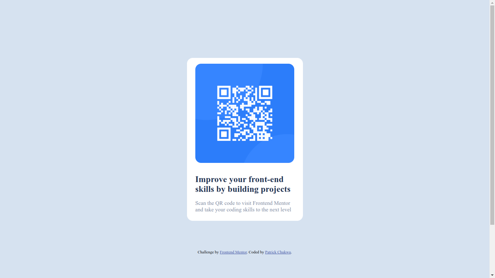

# Frontend Mentor - QR code component solution

This is a solution to the [QR code component challenge on Frontend Mentor](https://www.frontendmentor.io/challenges/qr-code-component-iux_sIO_H). 

## Table of contents

  - [Overview](#overview)
  - [Screenshot](#screenshot)
  - [Links](#links)
  - [My process](#my-process)
  - [Built with](#built-with)
  - [Author](#author)

## Overview
For my first frontend project, I built a webpage with an embedded QR code component.

### Screenshots of my results
##### Desktop version

##### Mobile version:

### Links

- Solution URL: [My codes](https://github.com/Patrick-Chukwu/MySuperRepo/tree/main/frontend_mentor_challenges/qr-code_page)
- Live Site URL: [live site](https://qr-code-tau-vert.vercel.app)

## My process
   - I built the markup first
   - Then I proceeded to style from top-to-bottom with Mobile-first workflow
   - Then worked on tablet and desktop to ensure a responsiveness.
   
### Built with

- Semantic HTML5 markup
- CSS custom properties
- Flexbox
- Mobile-first workflow

## Author

- Website - [Patrick Chukwu](https://www.your-site.com)
- Frontend Mentor - [@Patrick-Chukwu](https://www.frontendmentor.io/profile/Patrick-Chukwu)
- Twitter - [@pattyfean](https://www.twitter.com/pattyfean)

